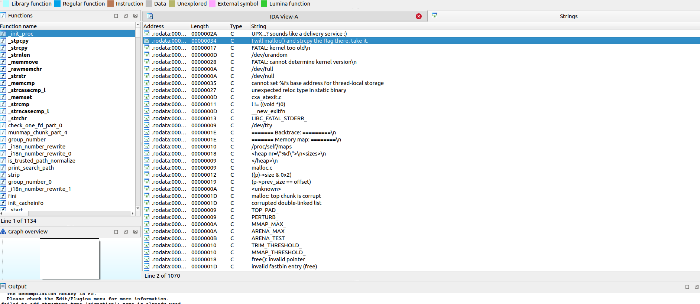

Voilà! A reversing challenge!

Run the executable (`flag`):
```bash
$ ./flag 
I will malloc() and strcpy the flag there. take it.
```

Let's open it in IDA.


  
Strange.... We barely have symbols, also it could not even resolve the location of main.... definitely something is not right. Maybe it's obfuscated.
We can run `strings flag` but when i tried it, it was too long, but i noticed something in the last lines, so let's look at it:
```bash
$ strings flag | tail -n5
Upbrk        
makBN        
su`"]R       
UPX!         
UPX!         
```
Hmmmmmmmmmmmmm, UPX is a pretty common packer for executables, let's try to confirm that:
```bash
$ strings flag | grep UPX
UPX!
$Info: This file is packed with the UPX executable packer http://upx.sf.net $
$Id: UPX 3.08 Copyright (C) 1996-2011 the UPX Team. All Rights Reserved. $
UPX!
UPX!
```

Yep... Let's then unpack this beast and try to reverse it using IDA once again.
```bash
$ upx -d flag
                       Ultimate Packer for eXecutables
                          Copyright (C) 1996 - 2020
UPX 3.96        Markus Oberhumer, Laszlo Molnar & John Reiser   Jan 23rd 2020

        File size         Ratio      Format      Name
   --------------------   ------   -----------   -----------
    883745 <-    335288   37.94%   linux/amd64   flag

Unpacked 1 file.
```

  

Welp, that looks way better. Let's find the output string (`I will malloc() and strcpy the flag there. take it.`)

  

Pretty easy, let's jump to its reference

  

ditto...

  

We found our main function, and more importantly, there's a constant `flag` variable in it!

  
